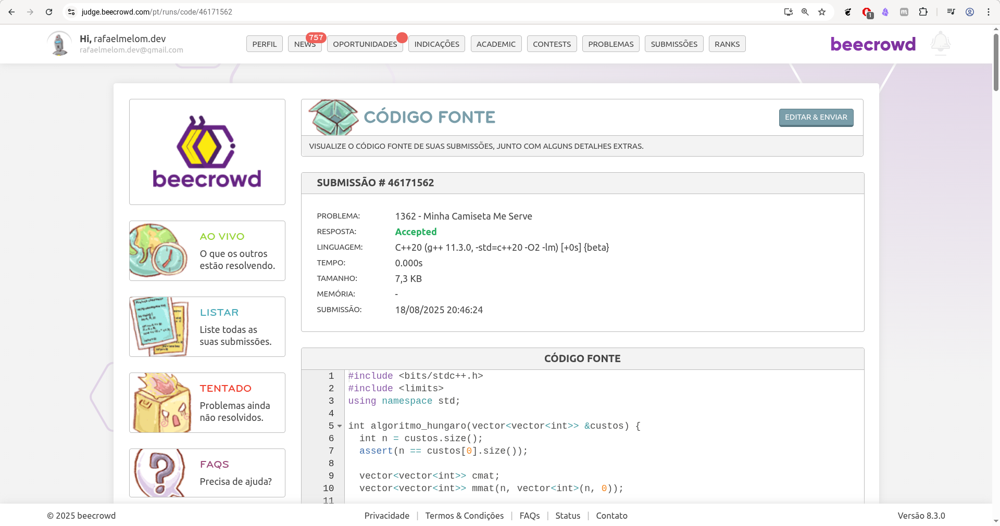

Solução do problema 1362, do site Beecrowd, utilizando o algoritmo Húngaro, utilizado para solucionar problemas de atribuições ótimas.

O problema tem o objetivo de checar se a combinação de camisas dadas conseguem se adequar a demanda dos voluntários. 

Informações importantes:
* Cada voluntário tem dois tamanhos possíveis;
* A quantidade de tamanhos de camisas é uniforme, por exemplo, se temos doze camisas, temos duas de cada tamanho (XS, S, M, L, XL, XXL). Consequentemente o número de camisas é múltiplo de 6;
* 1  <= N <= 36, sendo N a quantidade de camisetas disponíveis;
* 1 <= M <= 30, sendo M a quantidade de voluntários;
* e N >= M.

Solução proposta, podemos então montar uma matriz de custo, onde se a camiseta servir para o voluntário, o custo será de 0, e se não o custo foi atribuído a 10.

A seguir vemos um exemplo com uma das entradas do problema.

**6 4**  
**S XL**  
**L S**  
**L XL**  
**L XL**

(Com 6 camisas, 4 voluntários, e cada voluntários tem as possibilidades acima, sendo representados por cada linha)

|     | XS  | S   | M   | L   | XL  | XXL |
| --- | --- | --- | --- | --- | --- | --- |
| 1   | 10  | 0   | 10  | 10  | 0   | 10  |
| 2   | 10  | 0   | 10  | 0   | 10  | 10  |
| 3   | 10  | 10  | 10  | 0   | 0   | 10  |
| 4   | 10  | 10  | 10  | 0   | 0   | 10  |
| X   | 0   | 0   | 0   | 0   | 0   | 0   |
| X   | 0   | 0   | 0   | 0   | 0   | 0   |

Obs.: se tivéssemos mais de uma camisa de cada tamanho, teríamos uma coluna para cada camiseta, e não para cada tamanho, e o custo de zero seria atribuído a todas as colunas possíveis.

Obs.: temos 4 voluntários, mas na matriz precisamos de 6 linhas, dado que o algoritmo Húngaro funciona sobre matrizes quadradas, ou seja, de ordem **n** x **n**, então no caso as linhas ou colunas que forem adicionadas para a matriz se tornar quadrada, terão custo 0.

Agora com a matriz de custo a resolução do problema é simples, aplicamos o algoritmo Húngaro para encontrar a atribuição ótima, se o custo resultante for 0 então conseguimos alguma combinação possível de camisas para os voluntários, caso o custo não seja 0, então presumimos que a atribuição ótima teve que atribuir uma camisa que não serve a algum voluntário.

